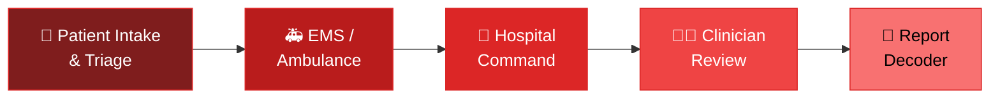
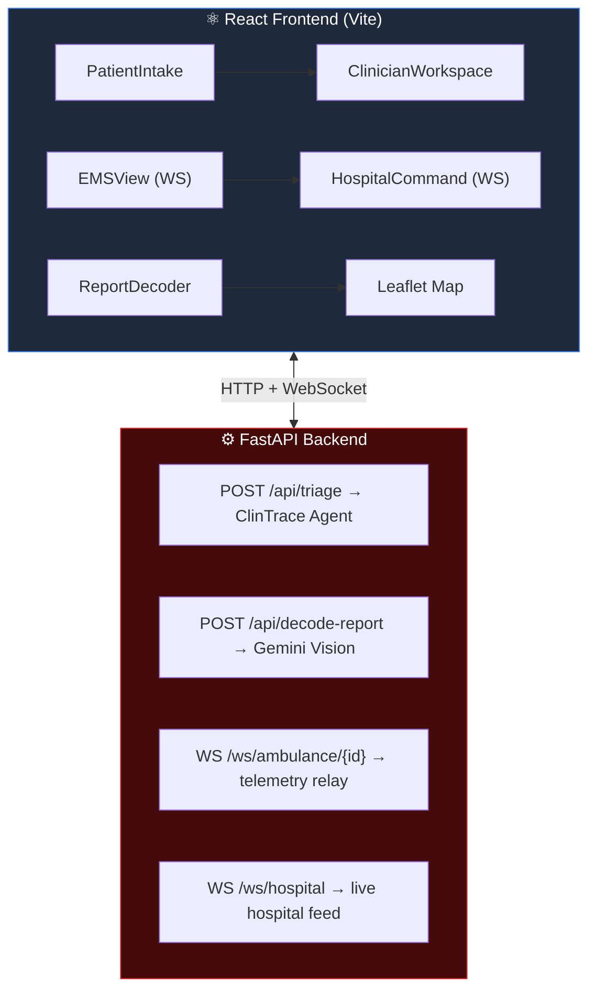

<div align="center">


[](https://git.io/typing-svg)

[](https://react.dev/)
[](https://vite.dev/)
[](https://fastapi.tiangolo.com/)
[](https://ai.google.dev/)
[](https://tailwindcss.com/)
[](LICENSE)


</div>

---

## 🚑 What is MEDOPS?

> Emergency care is fragmented. Information about an incoming patient often doesn't reach the hospital before the ambulance does.

**MEDOPS** connects field EMS units, hospital command centres, and clinicians into a single real-time workflow, closing the gap between dispatch and treatment.

<div align="center">



</div>

Each step shares real data through the same backend — **no manual handoffs, no repeated data entry.**

---

## ✨ Features

<table>
<tr>
<td width="50%" valign="top">

### 🧍 Patient Intake
Accepts free-text clinical notes, sends them through the triage pipeline, and returns a structured assessment report.

### 🚑 Ambulance View
Real-time dashboard with live ETA, distance, map, and a pre-arrival comms channel straight to the hospital.

### 🏥 Hospital Command
Command-centre map and incoming patient queue, fed by live telemetry from ambulances over WebSocket.

</td>
<td width="50%" valign="top">

### 👩‍⚕️ Clinician Review
Clinicians review AI-generated triage assessments before any clinical action — approve or override priority.

### 📄 Report Decoder
Upload a lab report or prescription (image/PDF). Gemini extracts the metrics and explains them in plain language — with multilingual translation.

</td>
</tr>
</table>

---

## 🧠 How It Works



The **triage pipeline** uses [Google ADK](https://developers.google.com/ai/adk) with Gemini to run a multi-step clinical reasoning agent:

1. 📝 Parse clinical notes
2. 🚨 Evaluate emergency indicators and red flags
3. 🏷️ Assign ESI triage priority
4. 📋 Generate a structured audit report

The **report decoder** uses **Gemini Vision** to read lab reports and translate findings into plain language.

---

## 🗺️ Mapping

<div align="center">

| Component | Choice |
|:---:|:---:|
| 🗺️ **Library** | [Leaflet.js](https://leafletjs.com/) — open source, no proprietary SDK |
| 🧱 **Tiles** | CartoDB Positron (default) — swappable via `tileProviders.js` |
| 🧭 **Routing** | [OSRM demo server](https://project-osrm.org/) with straight-line fallback |
| 📍 **Attribution** | OpenStreetMap contributors, on every map view |

</div>

> ⚠️ **Note:** The OSRM demo server is for development only. For production, deploy a self-hosted OSRM instance or use a commercial routing API. See `frontend/src/services/maps/tileProviders.js` to change providers.

---

## 🛠️ Tech Stack

<div align="center">

### Frontend


### Backend


</div>

---

## 🚀 Getting Started

### ✅ Prerequisites


Get your key from [Google AI Studio](https://aistudio.google.com/apikey) — needed for both triage and report decoding.

### 1️⃣ Clone the repository

```bash
git clone https://github.com/YOUR_USERNAME/medops.git
cd medops/medops-unified
```

### 2️⃣ Configure environment variables

**Backend:**
```bash
cd backend
cp .env.example .env
# Edit .env — at minimum, set GOOGLE_API_KEY and GEMINI_API_KEY
```

**Frontend:**
```bash
cd frontend
cp .env.example .env.local
# Edit .env.local if your backend runs on a different host/port
```

### 3️⃣ Install backend dependencies

```bash
cd backend
pip install -r requirements.txt
```

### 4️⃣ Start the backend

```bash
cd backend
uvicorn main:app --reload --port 8000
```

> 🌐 API: `http://localhost:8000` · 📚 Docs: `http://localhost:8000/docs`

### 5️⃣ Install and start the frontend

```bash
cd frontend
npm install
npm run dev
```

> 🖥️ Open `http://localhost:5173` in your browser.

---

## 🔐 Environment Configuration

Create your own environment files from the `.env.example` templates and provide the required API keys.

> 🚫 **Never commit `.env` or `.env.local` files to version control.**

<details open>
<summary><b>⚙️ Backend — <code>backend/.env</code></b></summary>
<br>

| Variable | Required | Description |
|:---|:---:|:---|
| `GOOGLE_API_KEY` | ✅ | Google AI API key for the ClinTrace triage agent |
| `GEMINI_API_KEY` | ✅ | Google AI API key for the Report Decoder (Gemini Vision) |
| `CLINICTRACE_MODEL` | ⬜ | Gemini model to use. Defaults to `gemini-2.5-flash` |
| `AGENT_ENGINE_RESOURCE_ID` | ⬜ | Vertex AI Agent Engine resource ID (for production deployment) |
| `PHOENIX_COLLECTOR_ENDPOINT` | ⬜ | Arize Phoenix OTEL endpoint for tracing |

</details>

<details open>
<summary><b>⚛️ Frontend — <code>frontend/.env.local</code></b></summary>
<br>

| Variable | Default | Description |
|:---|:---|:---|
| `VITE_BACKEND_URL` | `http://localhost:8000` | FastAPI backend HTTP URL |
| `VITE_BACKEND_WS` | `ws://localhost:8000` | FastAPI backend WebSocket URL |
| `VITE_DEMO_MODE` | `false` | Set to `true` to enable a synthetic demo ambulance on the map |

</details>

---

## 📁 Project Structure

```
medops-unified/
├── backend/
│   ├── main.py                     # FastAPI entry point
│   ├── requirements.txt
│   ├── .env.example
│   ├── api/
│   │   ├── triage.py               # POST /api/triage
│   │   └── decoder.py              # POST /api/decode-report
│   ├── realtime/
│   │   └── sockets.py              # WebSocket relay (/ws/*)
│   ├── database/
│   │   ├── database.py             # SQLAlchemy engine
│   │   └── models.py               # ORM models (Patient, Case, TriageAssessment)
│   └── clintrace_agent/            # Multi-step triage reasoning agent (Google ADK)
│       ├── agent.py
│       ├── runtime.py
│       ├── config.py
│       └── ...
└── frontend/
    ├── .env.example
    ├── index.html
    ├── vite.config.js
    └── src/
        ├── App.jsx                 # App shell, routing, layout
        ├── main.jsx
        ├── index.css               # Design system (light theme, utilities)
        ├── api.js                  # Shared API helpers
        ├── context/
        │   └── AmbulanceLocationContext.jsx  # Shared real-time ambulance state
        ├── pages/
        │   ├── PatientIntake.jsx
        │   ├── EMSView.jsx
        │   ├── HospitalCommand.jsx
        │   └── ClinicianWorkspace.jsx
        ├── components/
        │   ├── MedopsMap.jsx       # Leaflet map wrapper
        │   ├── ReportDecoder.jsx
        │   └── OfflineBanner.jsx
        └── services/
            └── maps/
                ├── mapService.js       # Leaflet abstraction
                ├── tileProviders.js    # Tile/routing provider config
                └── demoLocations.js    # Synthetic demo coordinates
```

---

## ⚠️ Current Limitations

- 🔓 **Authentication:** No production authentication/authorization layer yet.
- 💾 **Data persistence:** Case data currently persists only for the active browser session — not backed by a production database.
- 🧭 **Routing:** Uses an OSRM demo endpoint, intended for development/testing rather than production scale.
- 🏥 **Clinical use:** MEDOPS is a software prototype for clinical decision support and is **not a certified medical device** — it must not substitute professional medical judgment.

---

<div align="center">

## 🏥 Safety Notice

</div>

> MEDOPS is a software engineering project. It is **not** a certified medical device, is **not** HIPAA-compliant, and is **not** intended to replace clinical judgment.

- 🩺 All triage assessments are generated by a large language model and **must be reviewed by a licensed clinician** before any clinical action is taken.
- 🔒 No real patient data is included in this repository.
- 🚫 Do not use this software for actual patient care without appropriate clinical oversight and regulatory clearance.

---

## 🤝 Contributing

1. 🍴 Fork the repository
2. 🌿 Create a feature branch: `git checkout -b feature/your-feature`
3. 🔑 Copy `.env.example` files and configure your own environment
4. 📦 Install dependencies (frontend + backend)
5. 🧪 Make your changes, test locally
6. 📤 Submit a pull request with a clear description

> 🚫 Please do not commit real API keys, credentials, or patient data.

---

## 📄 License

Licensed under the **MIT License** — see [LICENSE](LICENSE) for details.

---

<div align="center">

### ❤️ Built for better emergency care coordination


</div>
